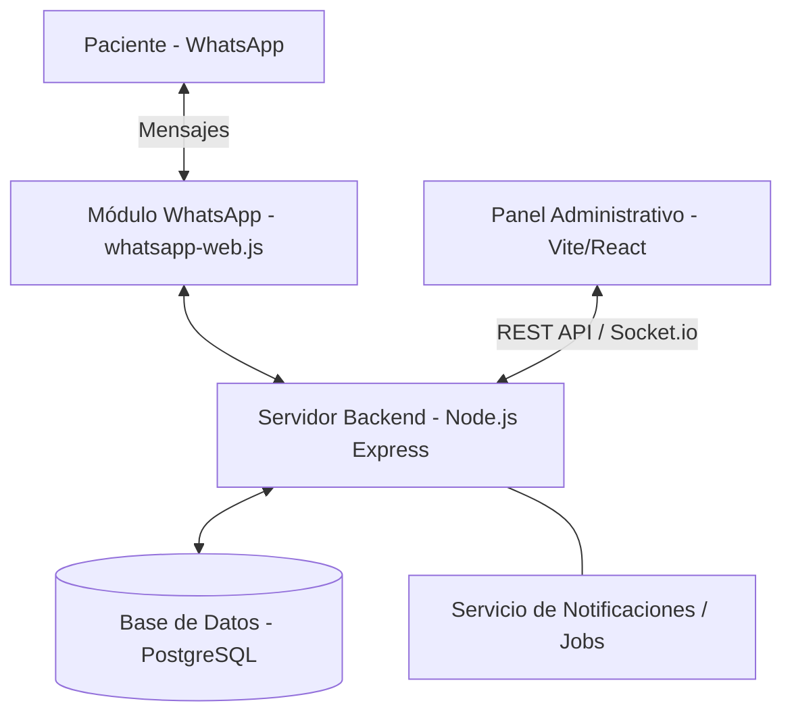
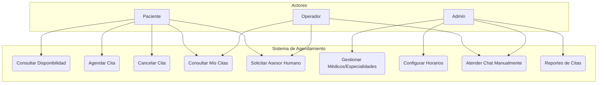
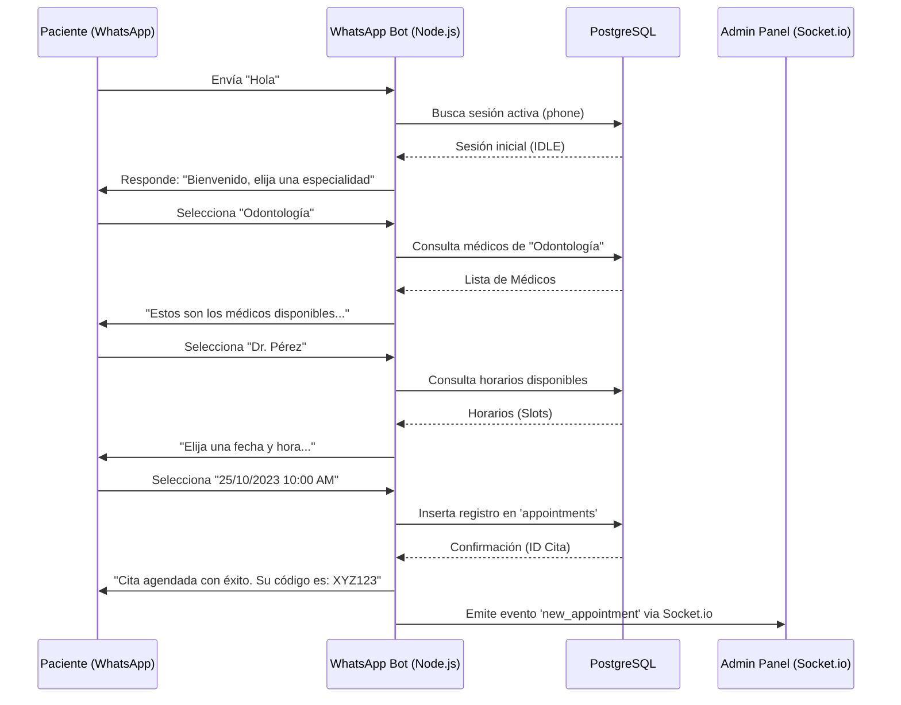
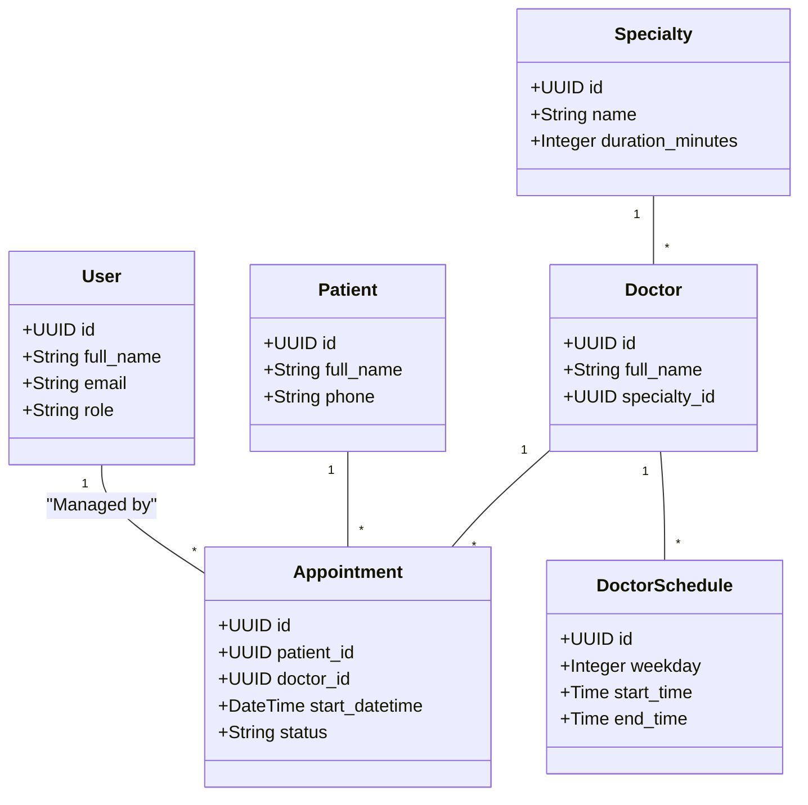
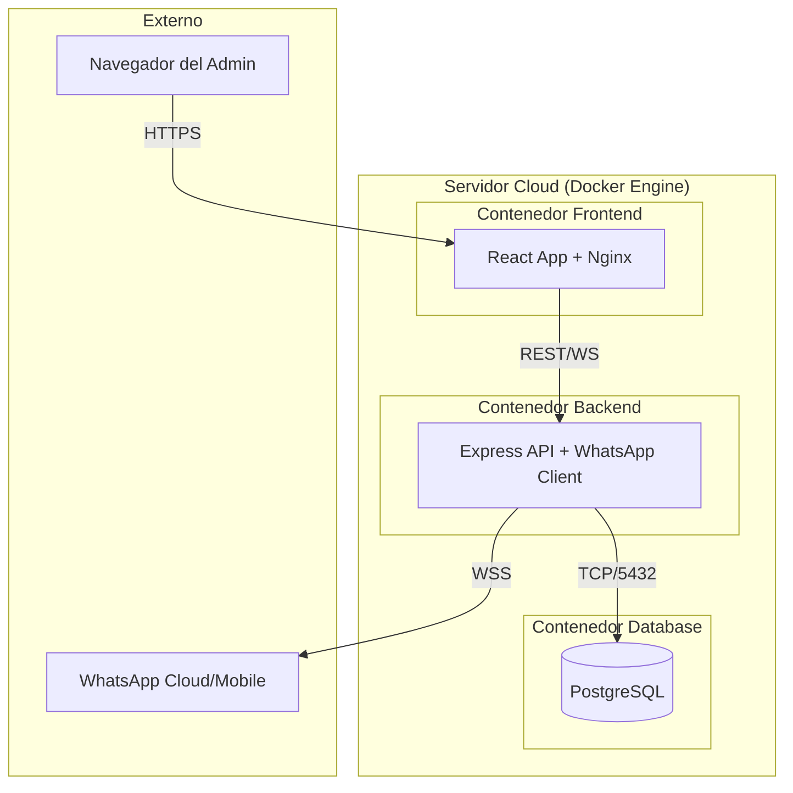
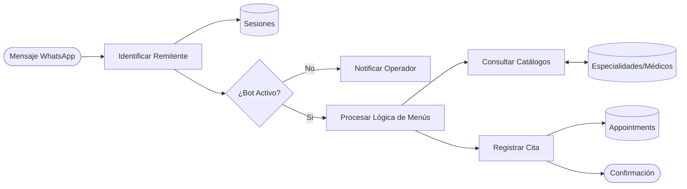

# Documentación Técnica: Sistema de Agendamiento de Citas Hospitalarias (WhatsApp Bot)

## Introducción
El presente documento detalla la arquitectura, el diseño y el flujo operativo del Sistema de Agendamiento de Citas Médicas. Este sistema ha sido diseñado para optimizar la gestión de consultas hospitalarias mediante la automatización de procesos a través de un Bot de WhatsApp y un Panel Administrativo integral.

El objetivo principal es reducir la carga operativa del personal humano y ofrecer a los pacientes un canal de comunicación inmediato, disponible 24/7, eliminando tiempos de espera telefónicos y simplificando el proceso de reserva.

---

## 1. Arquitectura General del Sistema
La arquitectura se basa en un modelo de microservicios ligero, donde el backend actúa como el núcleo orquestador.

### Descripción de Componentes:
*   **Interfaz de Usuario (WhatsApp):** Canal principal de entrada. Se utiliza la librería `whatsapp-web.js` para emular un cliente de WhatsApp Web, permitiendo la interacción sin costos de API oficiales de Meta inicialmente.
*   **Backend (Node.js/Express):** Gestiona la lógica de negocio, autenticación JWT, y el motor de estados de las conversaciones.
*   **Persistencia (PostgreSQL):** Base de datos relacional que garantiza la integridad de la información de citas, doctores y pacientes.
*   **Panel Administrativo:** Una Single Page Application (SPA) que permite a los operadores monitorear chats en tiempo real y gestionar catálogos.

---

## 2. Diagrama de Casos de Uso
El sistema define tres perfiles de usuario claramente diferenciados para garantizar la seguridad y eficiencia.

### Justificación de Roles:
*   **Paciente:** Centrado en el autoservicio. Puede gestionar su ciclo de cita sin intervención humana.
*   **Operador:** Enfocado en la atención al cliente. Interviene cuando el bot no puede resolver una duda o cuando se solicita asistencia humana.
*   **Administrador:** Control total sobre la infraestructura de datos (médicos, especialidades y horarios globales).

---

## 3. Diagrama de Secuencia: Flujo de Agendamiento
Este diagrama ilustra la coreografía de mensajes y la sincronización con el panel administrativo.

### Análisis del Proceso:
El sistema utiliza una **Máquina de Estados Finita (FSM)**. Cada mensaje del usuario transiciona la sesión a un nuevo estado (ej: `AWAITING_SPECIALTY` -> `AWAITING_DOCTOR`), asegurando que el flujo sea lógico y que los datos se capturen de forma estructurada.

---

## 4. Diagrama de Clases (Modelo de Datos)
La estructura de datos está optimizada para consultas rápidas de disponibilidad.

### Características del Modelo:
*   **Normalización:** Los datos están altamente normalizados para evitar redundancias.
*   **Relaciones Clave:** La vinculación entre `DoctorSchedule` y `Appointment` permite calcular espacios disponibles en tiempo real restando las citas existentes de los bloques de horario del médico.

---

## 5. Diagrama de Despliegue
Implementación basada en contenedores para facilitar la portabilidad y escalabilidad.

### Ventajas del Despliegue:
*   **Aislamiento:** Cada componente corre en su propio entorno seguro.
*   **Recuperación:** Mediante políticas de Docker, el servidor se reinicia automáticamente en caso de fallo crítico en el cliente de WhatsApp.

---

## 6. Diagrama de Flujo de Datos (DFD)
Muestra la transformación de un mensaje de texto plano en una transacción de base de datos.

---

## Seguridad y Escalabilidad
*   **Seguridad:** Las rutas administrativas están protegidas mediante `JWT` (JSON Web Tokens). Toda la comunicación entre el frontend y backend se realiza sobre protocolos encriptados.
*   **Escalabilidad:** El backend está preparado para integrarse con la API oficial de WhatsApp Business (Cloud API) en el futuro, permitiendo manejar miles de conversaciones simultáneas sin degradación de rendimiento.

---
**Elaborado por:** Departamento de Desarrollo - Ideon Company
**Fecha:** Abril 2026
